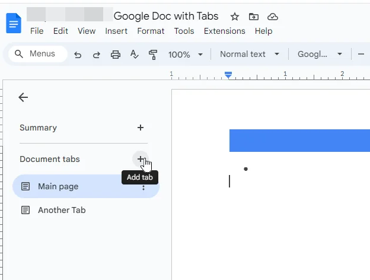

## What is Moracarta?

Moracarta is a CLI tool that turns your letters into a personalized love-letter website that you can deploy for free.  

💌 Multiple letters  
📝 Google Docs as your writing interface  
🎨 Customizable texts  
🌐 Free web deployment  
🔒 No database required  

## You can have your own love letters website running on the web — completely free — in less than 5 minutes.

## And it's as simple as:

```bash
git clone https://github.com/WesleyHanauer/moracarta
cd moracarta
npm install
moracarta setup
moracarta build
moracarta deploy
```

### App Demo
<p align="center">
    
    
</p>

### Setup Demo


<br><br>

## That's it.

All that's left is to write your custom letters in Google Docs and, if you want, customize the two texts displayed on the main page.

## Requirements

- Node.js 22+
- A Google account

### Adding letters

```bash
moracarta add
```

* Paste the link to your public Google Doc.
* **IMPORTANT:** Use spaces for indentation instead of `TAB`.
* Use a different Google Docs **tab** for each letter to keep your Google Doc organized.  

<p align="center">
    
</p>
<br>

### Removing letters

```bash
moracarta remove
```

Select the letter you wish to remove.

## License

Moracarta is open-source software licensed under the **MIT License**.

See the [LICENSE](LICENSE) file for the full license text.
