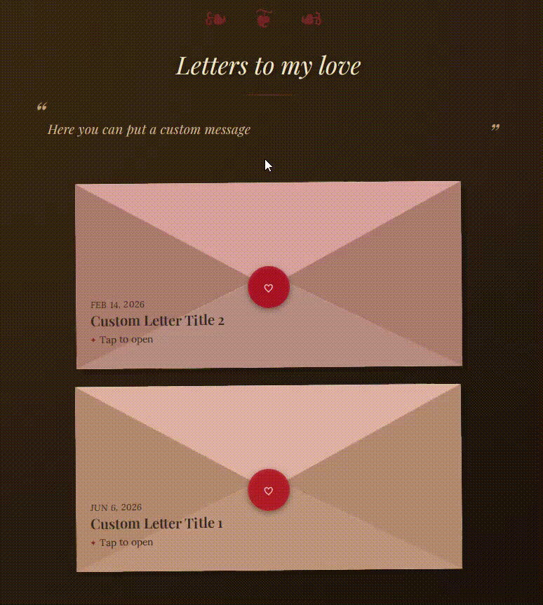

# Moracarta

Create a personalized romantic website with digital letters, music, animations, and more — without needing a backend.

## Table of Contents

1. [Demo](#demo)
2. [Getting Started](#getting-started)
3. [Configuration](#configuration)
4. [Music](#music)
5. [Deployment](#deployment)
6. [Technologies](#technologies)
7. [Project Structure](#project-structure)
8. [License](#license)

## Demo




## Getting Started

Moracarta is designed to make creating a personalized romantic website as simple as possible.

### Requirements

You need:

- [Node.js](https://nodejs.org/)
- npm

### 1. Clone the Repository

Clone the repository and install the dependencies:

```bash
git clone https://github.com/WesleyHanauer/moracarta.git
cd moracarta
npm install
```

### 2. Configure Your Website

Run the interactive setup:

```bash
npm run setup
```

Moracarta will guide you through the configuration of your website, including:

- Application language
- Project name
- Application title
- Password protection
- Font
- Music
- Main page messages
- Your name
- Envelope text

The setup generates the configuration file:

```text
src/config/globalVariables.js
```

### 3. Start the Development Server

After completing the setup, start the development server:

```bash
npm run dev
```

This allows you to preview your website while developing.

### 4. Add Your Letters

Your letters are stored in:

```text
src/data/letters.js
```

Add or edit your letters there.

A template is provided at the top of the file showing how to create additional letters.

### 5. Build Your Website

When you are happy with your website, create a production build:

```bash
npm run build
```

The production files will be generated inside:

```text
dist/
```

### 6. Preview the Production Build

You can preview the production version locally with:

```bash
npm run preview
```

This allows you to verify the version that will be deployed.

### 7. Deploy

Once everything looks good, deploy your website:

```bash
npm run deploy
```

Your website will be built and deployed to Cloudflare Pages.

That's it! ❤️

## Configuration

### General Configuration

Most of the website's configurable values are generated automatically by the setup script and stored in:

```text
src/config/globalVariables.js
```

You can manually modify this file after running the setup if necessary.

It is recommended to open the website at least once before modifying the configuration so you can understand what each option controls.

### Letters

Letters are stored in:

```text
src/data/letters.js
```

Each letter is represented as an object.

A template is provided at the top of the file showing how to create additional letters.

It is recommended to write longer letters separately in an editor such as Google Docs and then paste them into the corresponding letter object.

Music paths for individual letters must point to `.mp3` files.

## Music

Moracarta supports optional music on the main page and individual letters.

Music can be configured during the setup process:

```bash
npm run setup
```

### Individual Letter Music

Individual letters can have their own music.

The music starts when the user opens the letter and interacts with the page, according to the browser's autoplay restrictions.

You can also configure the timestamp at which the music starts.

Only use music that you have permission to distribute and host. Royalty-free music libraries are recommended for finding suitable tracks.

For more information about music configuration, see [docs/MUSIC.md](docs/MUSIC.md).

## Deployment

Moracarta generates a static website, so it does not require a backend server.

### Build

Create a production build with:

```bash
npm run build
```

This generates the production files inside:

```text
dist/
```

### Preview

Before deploying, you can preview the production build locally:

```bash
npm run preview
```

### Cloudflare Pages

Cloudflare Pages is recommended for hosting Moracarta websites.

Deploy your website with:

```bash
npm run deploy
```

The deployment command:

1. Builds the production version.
2. Generates the `dist/` directory.
3. Deploys `dist/` to Cloudflare Pages.
4. Uses the project name configured during setup.

The project name is configured when you run:

```bash
npm run setup
```

After making changes to your website, simply run:

```bash
npm run deploy
```

again.

The new version will be deployed to the same Cloudflare Pages project rather than creating a new website.

### GitHub Pages

Moracarta can also be hosted using GitHub Pages.

Keep in mind that if the repository is public, the contents of your letters will also be publicly visible in the repository.

For private letters, a private repository and a hosting provider that supports private repositories may be preferable.

## Technologies

- JavaScript
- HTML
- CSS
- Vite
- Wrangler
- Node.js

## Project Structure

```text
moracarta/

├── src/
│   ├── config/
│   │   └── globalVariables.js
│   │
│   ├── data/
│   │   └── letters.js
│   │
│   ├── styles/
│   │
│   ├── scripts/
│   │   ├── setup.js
│   │   └── deploy.js
│   │
│   ├── views/
│   │
│   └── i18n/
│
├── public/
│
├── assets/
│   ├── images/
│   └── music/
│
├── index.html
├── package.json
├── README.md
├── README.pt-BR.md
└── LICENSE
```

### Important Files and Directories

`src/config/globalVariables.js`

General configuration generated by the setup script.

`src/data/letters.js`

Contains the content and configuration of individual letters.

`src/styles/`

Website styling, animations, and visual effects.

`src/scripts/`

Application logic, setup, deployment, animations, and other scripts.

`src/views/`

Additional HTML pages and templates used by the application.

`src/i18n/`

Translation files and language configuration.

`assets/images/`

Images used by the website.

`assets/music/`

Music files used in the letters and on the main page.

`public/`

Static files that should be copied directly into the production build.

`index.html`

The main entry point of the website.

## License

This project is licensed under the MIT License. See the [LICENSE](LICENSE) file for details.
